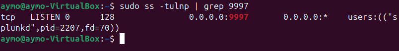
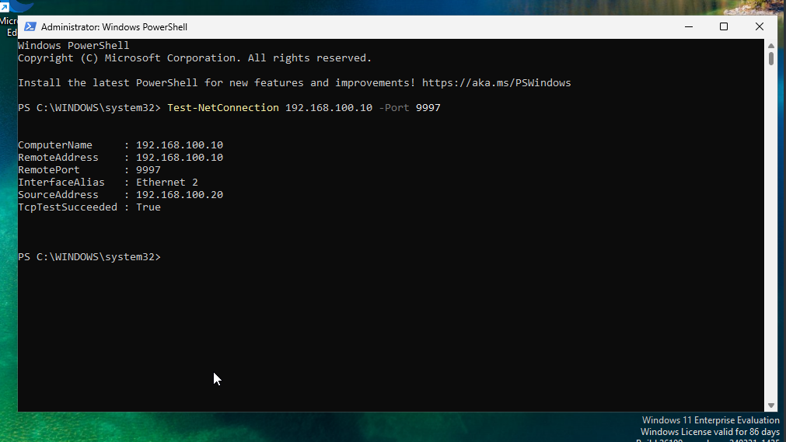
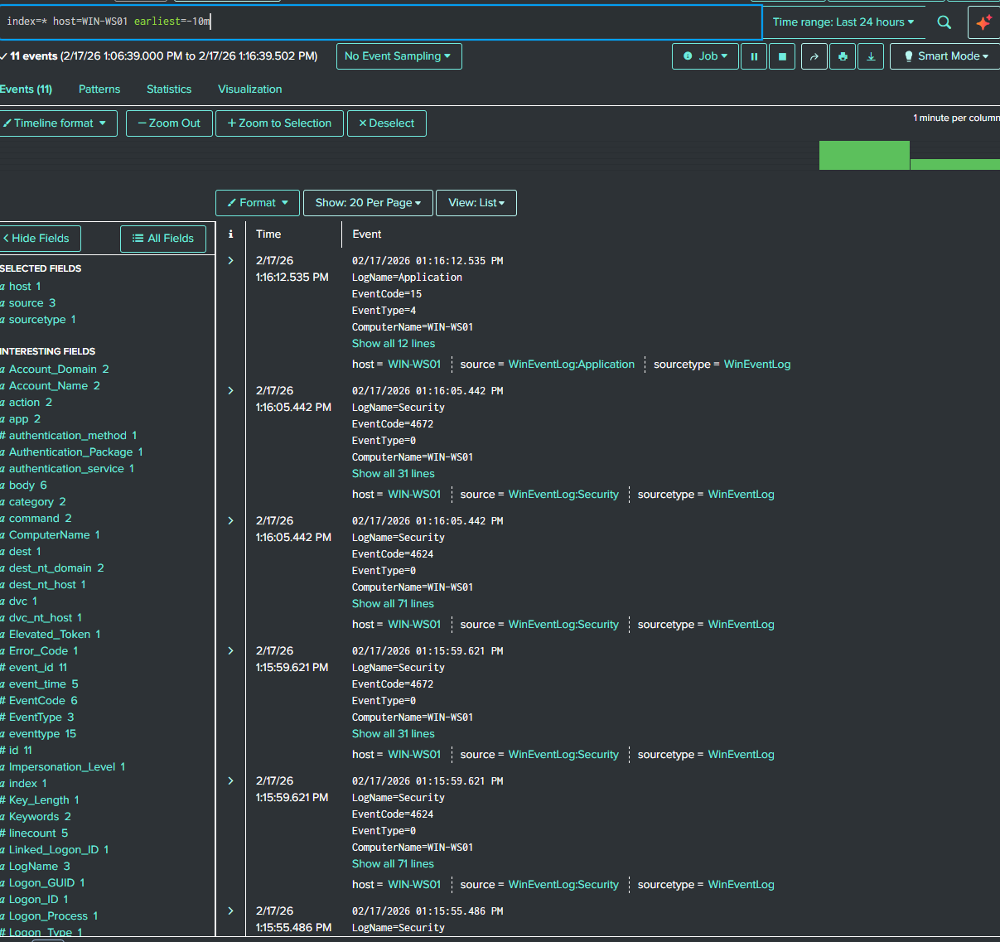
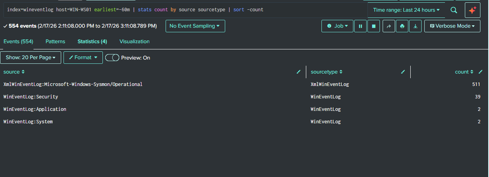
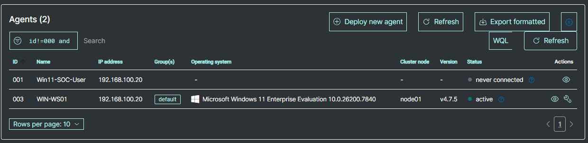
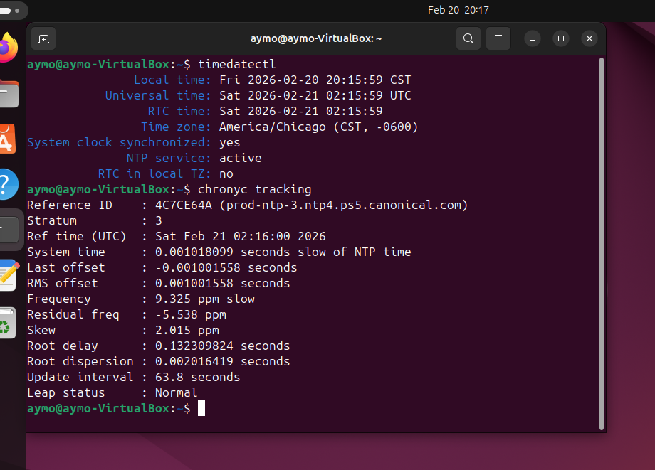
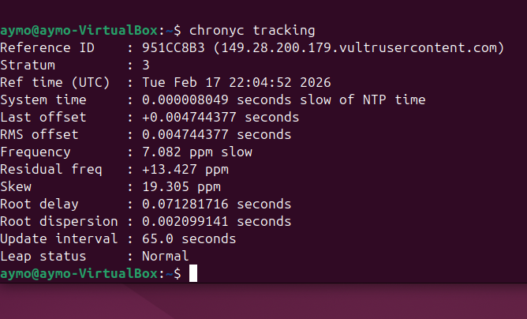
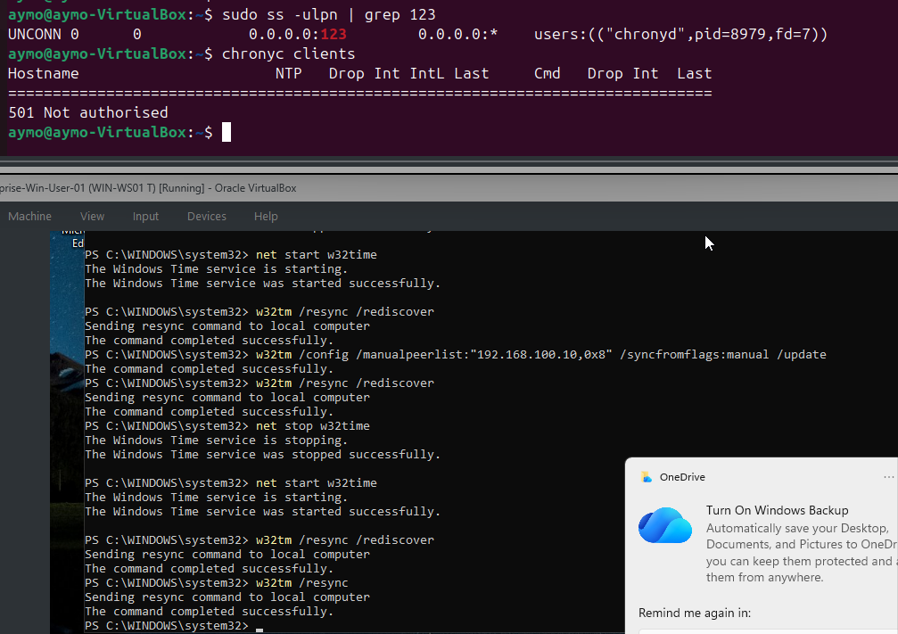
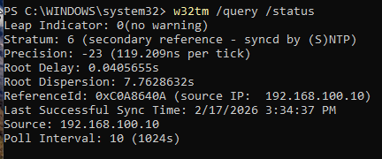

# Telemetry Validation Evidence

This page collects screenshots showing successful lab end states after setup and troubleshooting. The screenshots are included to document working telemetry, connectivity, agent status, and time synchronization without overstating detection or investigation outcomes.

## Splunk Receiver and Forwarder Connectivity

The Ubuntu/Splunk system is listening on TCP port `9997`, the Windows endpoint can reach the receiver, and the Universal Forwarder shows the Splunk receiver as an active forwarding target.

## Windows Event Log Ingestion

Windows Security, Application, and System logs from host `WIN-WS01` are searchable in Splunk.

## Sysmon Telemetry Ingestion

Sysmon Operational telemetry is successfully arriving in Splunk and appears alongside standard Windows event logs.

## Wazuh Agent Status

Wazuh shows the Windows endpoint as active. Any older never-connected duplicate agent entry is historical cleanup noise, not the validated endpoint.

## Time Synchronization Validation

Chrony is synchronized on Ubuntu, and Windows is configured to sync against the lab time source. This supports consistent event correlation across the lab.

