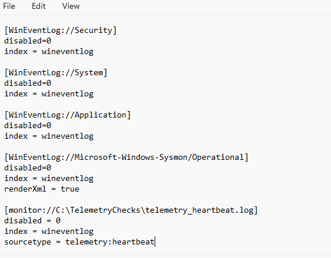
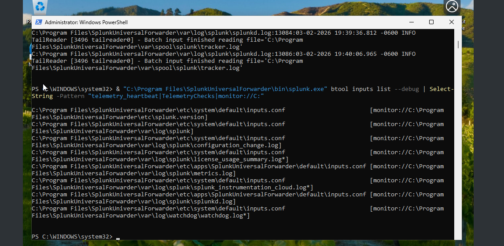
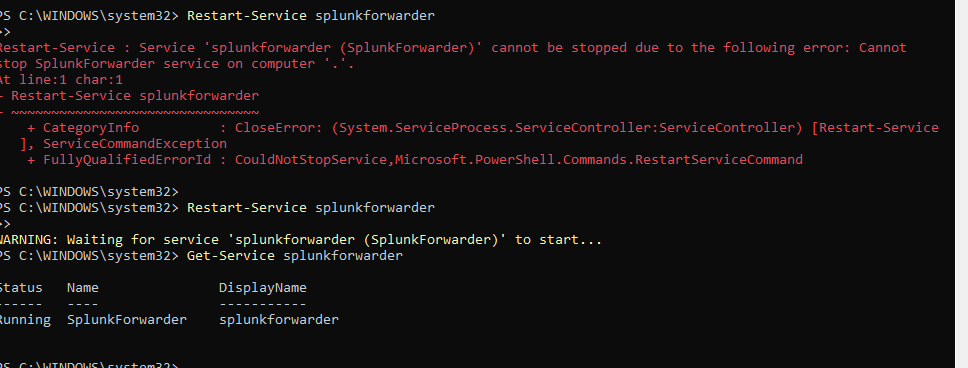
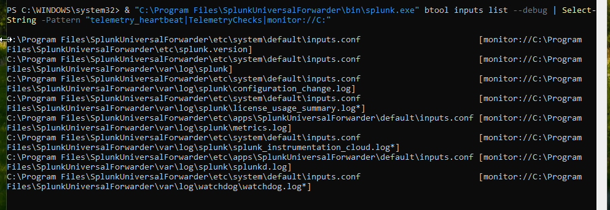

# Heartbeat Monitoring

## Summary

This case documents configuration and troubleshooting evidence for a telemetry heartbeat monitor.

## Symptom

The lab needed a monitored heartbeat file so telemetry silence and ingestion behavior could be validated independently from Windows event volume.

## Investigation

`inputs.conf` included a monitor stanza for `C:\TelemetryChecks\telemetry_heartbeat.log`. `btool inputs list --debug` was used to inspect effective monitor configuration and configuration precedence. One restart attempt failed before the SplunkForwarder returned to a running state.

## Root Cause

The available evidence focuses on configuration precedence and service restart behavior. It does not prove that heartbeat events were searchable in Splunk.

## Resolution

The heartbeat monitor stanza was present in `inputs.conf`, and later `btool` output confirmed the monitor stanza was loaded.

## Validation

Validation in this phase confirms configuration presence and effective stanza loading. Searchable heartbeat events are not claimed because no search-result screenshot is included.

## Engineering Lesson

`btool` is useful for validating effective Splunk forwarder configuration and precedence. Configuration validation still needs to be paired with separate event-search validation.

## Evidence

*`inputs.conf` included a monitor stanza for `C:\TelemetryChecks\telemetry_heartbeat.log`.*

*`btool inputs list --debug` was used to inspect effective monitor configuration and precedence.*

*One restart attempt failed before the SplunkForwarder returned to a running state.*

*Later `btool` output confirmed the heartbeat monitor stanza was loaded.*
