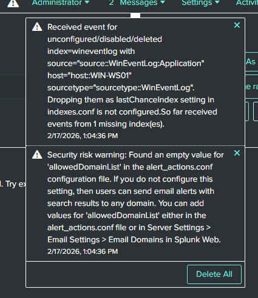

# Missing Windows Event Index

## Summary

This case documents a Splunk indexing problem where Windows events were forwarded toward Splunk but were dropped because the destination index was not available.

## Symptom

Splunk reported received events for `index=wineventlog` and warned that events were being dropped because the index was unconfigured, disabled, or deleted.

## Investigation

The warning showed that events were reaching Splunk far enough for Splunk to evaluate their target index. This narrowed the issue away from basic forwarder connectivity and toward index availability on the receiver.

## Root Cause

The available evidence supports an index configuration problem for `index=wineventlog`. This phase does not include index-creation or final successful-ingestion screenshots, so it does not claim the full remediation cycle is proven here.

## Resolution

The documented remediation direction is to ensure that the destination index exists and is enabled before relying on forwarded events as successfully indexed telemetry.

## Validation

The available validation is the Splunk warning that events were dropped because the destination index was not configured, enabled, or present. Final successful ingestion is not shown in this phase.

## Engineering Lesson

Forwarder connectivity does not prove successful indexing. Receiver-side index configuration must be validated as a separate layer.

## Evidence

*Splunk reported events for `index=wineventlog` being dropped because the destination index was unconfigured, disabled, or deleted.*
