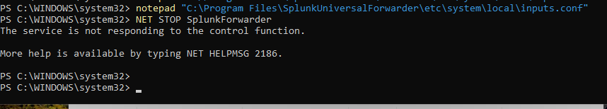
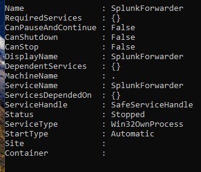
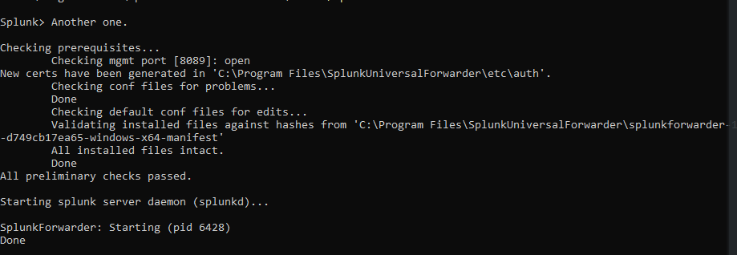
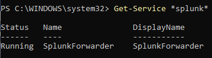
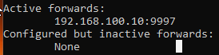

# Splunk Forwarder Service Recovery

## Summary

This case documents Splunk Universal Forwarder service troubleshooting on the Windows endpoint.

## Symptom

A restart attempt initially reported that the SplunkForwarder service could not be stopped. A later service inspection showed the forwarder in a stopped state while configured for automatic startup.

## Investigation

The investigation checked the Windows service state, then used Splunk CLI checks to verify prerequisites and configuration. Separate setup evidence shows the forwarder service running and the active receiver configured at `192.168.100.10:9997`.

## Root Cause

The available screenshots show a service-control and recovery issue. They do not establish a deeper root cause beyond the forwarder service failing to stop cleanly and later being observed stopped.

## Resolution

Splunk CLI checks passed, and the forwarder daemon was subsequently started. Later evidence shows the SplunkForwarder service running.

## Validation

Validation is split across multiple layers: service running state, successful configuration checks, daemon start output, and active forward server state.

## Engineering Lesson

Forwarder troubleshooting should separate Windows service state, Splunk CLI health checks, and forwarding destination state. Each layer can succeed or fail independently.

## Evidence

*The initial restart attempt reported that the service could not be stopped.*

*Service inspection later showed SplunkForwarder stopped with automatic startup configured.*

*Splunk CLI prerequisite and configuration checks passed before starting the daemon.*

*A later restart attempt returned the SplunkForwarder service to a running state.*

*Separate setup evidence confirms the SplunkForwarder service running.*

*The forwarder reported `192.168.100.10:9997` as an active forward server.*
