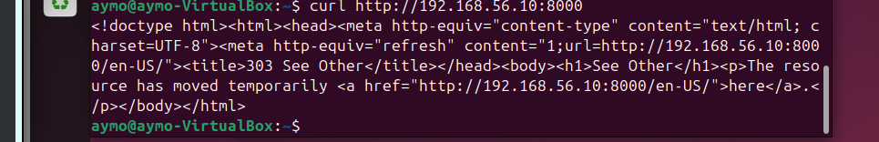

# Splunk Web Connectivity

## Summary

This case documents HTTP reachability validation for Splunk Web.

## Symptom

Splunk Web reachability needed to be validated from a system using HTTP.

## Investigation

`curl http://192.168.56.10:8000` returned Splunk Web HTML.

## Root Cause

No outage root cause is claimed from this evidence. The screenshot documents a successful reachability check rather than a complete incident.

## Resolution

The HTTP response showed that Splunk Web was reachable from that system.

## Validation

The response included Splunk Web HTML and an HTTP redirect to `/en-US/`.

## Engineering Lesson

HTTP response content and redirects can validate service reachability even before logging into the web interface.

## Evidence

*`curl` returned Splunk Web HTML and an HTTP redirect to `/en-US/`.*
