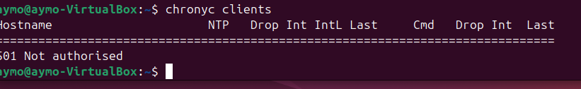
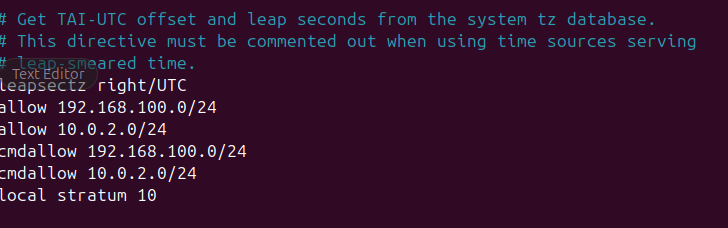
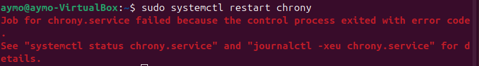
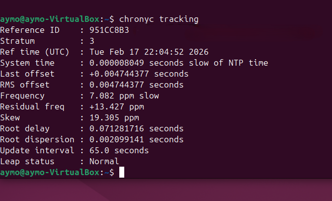

# Time Synchronization

## Summary

This case documents iterative Chrony troubleshooting for lab time synchronization.

## Symptom

`chronyc clients` returned `Not authorised`, indicating that the client was not authorized to query or use the configured Chrony service as expected.

## Investigation

Chrony configuration was inspected and updated to include `allow` rules for the lab networks `192.168.100.0/24` and `10.0.2.0/24`. One Chrony restart attempt failed before later tracking output showed healthy synchronization indicators.

## Root Cause

The available evidence supports an authorization/configuration issue followed by an unsuccessful service restart attempt. The screenshots present this as an iterative troubleshooting process, not a perfect first-attempt configuration.

## Resolution

Chrony allow rules were configured for the lab networks. Later tracking output showed Stratum 3, normal leap status, and very small system and last offsets.

## Validation

`chronyc tracking` later showed Stratum 3, normal leap status, and small offsets. This validates Chrony tracking health at that point in the troubleshooting process.

## Engineering Lesson

Time synchronization requires both network authorization and service health validation. Configuration changes should be followed by restart checks and tracking validation.

## Evidence

*Initial client check returned `Not authorised`.*

*Chrony configuration included `allow` rules for `192.168.100.0/24` and `10.0.2.0/24`.*

*One Chrony restart attempt failed and required further troubleshooting.*

*Later tracking output showed Stratum 3, normal leap status, and very small offsets.*
